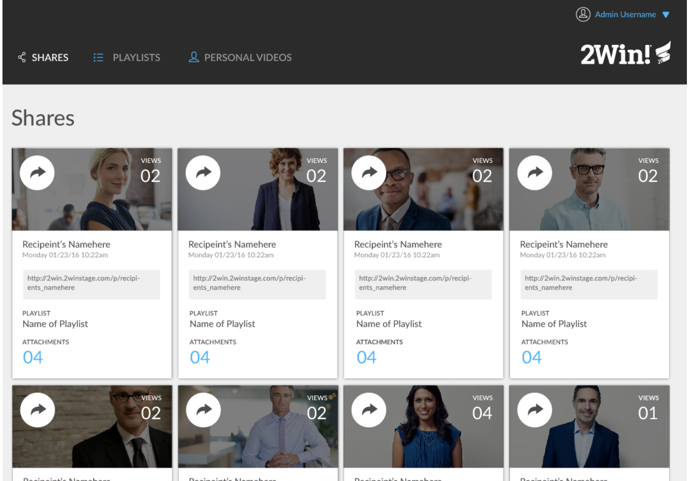
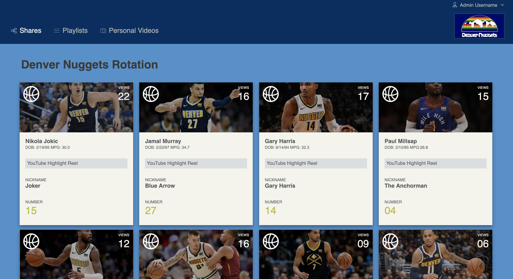

# Static Comp Challenge 1
This website was my second project for Turing School. We were given a comp to replicate and encouraged to draw upon everthing we have learned thus far about HTML and CSS. I utilized flex-box in CSS, but we were instructed to not use grid. As we were given some stylistic liberties, I opted to make a website that shows the main rotation for my favorite sports team, the Denver Nuggets.

### Screenshots
What we were asked to replicate:

My site:

### What I gained from this project
This assignment helped solidify my knowledge of implementing CSS rules for positioning items within boxes, and got me to experiment with different strategies to do this. Also, I learned about making a responsive site, implementing some media queries and using percentages in my widths to cover the screen for whatever device may pull up this page. 
